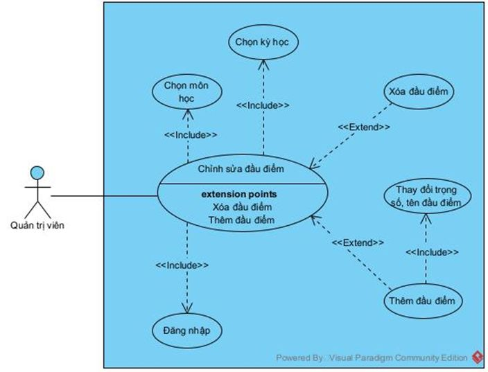
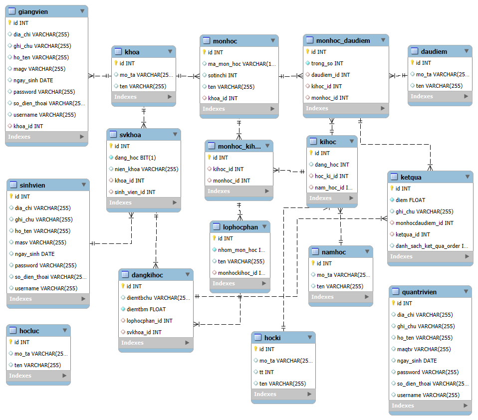
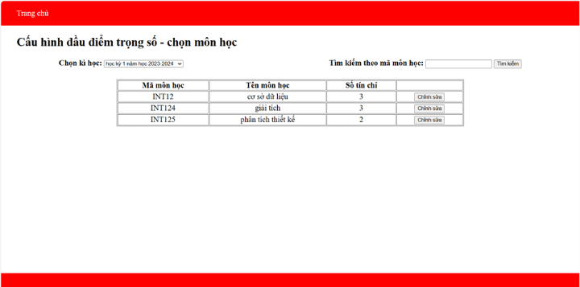
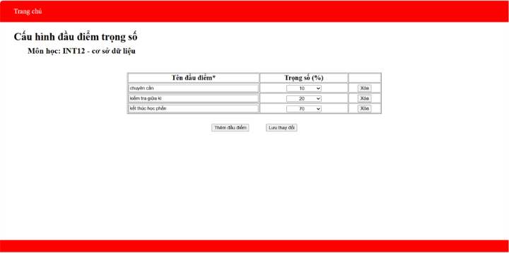

# Chức năng cấu hình đầu điểm - trọng số (Spring boot - MVC)
### Giới thiệu:
- Là một chức năng trong hệ thống quản lý đạo tạo sinh viên.
- Cho phép chỉnh sửa số lượng đầu điểm của môn học và trọng số của mỗi đầu điểm.
    > ví dụ: Môn toán rời rạc có 3 **đầu điểm** là: *chuyên cần, kiểm tra giữa kỳ, kiểm tra kết thúc học phần* với các **trọng số** tượng ứng là: *10%, 30%, 60%*.
- Yêu cầu:
    - Sau khi thay đổi đầu điểm trọng số của môn học, kết quả của môn học đó tại các kì học trước đây không thay đổi.
#### Công nghệ sử dụng:
- **Spring boot - Java 17**
- **Thymeleaf** 
- **Spring Data JPA**
- **MySQL**
- **Junit**
## Phân tích thiết kế
### Use case:

### Kịch bản: 
<table border="1">
    <tr>
        <th>
            Use case
        </th>
        <th>
            Chỉnh sửa đầu điểm và trọng số.
        </th>
    </tr>
    <tr>
        <td>Actor</td>
        <td>Quản trị viên.</td>
    </tr>
    <tr>
        <td>Tiền điều kiện</td>
        <td>Quản trị viên đã có tài khoản và đăng nhập thành công vào hệ thống. Sự thay đổi được phê duyệt từ khoa.</td>
    </tr>
    <tr>
        <td>Hậu điều kiện</td>
        <td>Quản trị viên chỉnh sửa thành công đầu điểm và trọng số.</td>
    </tr>
    <tr>
        <td>Kịch bản chuẩn</td>
        <td>1.	Sau khi đăng nhập thành công, tại giao diện trang chủ của quản trị viên, quản trị viên chọn chức năng “Chỉnh sửa đầu điểm cho môn học”.
 2.	Giao diện trang cấu hình hiện lên chứa chức năng 
 3.	Quản trị viên chọn chức năng “Chỉnh sửa đầu điểm cho môn học”.
 4.	Giao diện chọn kỳ học hiện lên với danh sách các kỳ học đang học.
 5.	Quản trị viên chọn kỳ học muốn áp dụng số lượng đầu điểm mới.
 6.	Giao diện chọn môn học hiện lên:1 ô nhập tìm kiếm môn học theo mã môn học và 1 nút “Tìm kiếm”.
 7.	Quản trị viên nhập mã môn học “INT1449” và nhấn “Tìm kiếm”.
 8.	Giao diện hiện lên thông tin kỳ học, môn học và bảng sau:
<table>
    <tr>
        <th>Tên đầu điểm</th>
        <th>Trọng số</th>
        <th></th>
    </tr>
    <tr>
        <td>Chuyên cần</td>
        <td>10%▼</td>
        <td>Xóa</td>
    </tr>
        <tr>
        <td>Kiểm tra giữa kỳ</td>
        <td>10%▼</td>
        <td>Xóa</td>
    </tr>
        <tr>
        <td>Bài tập lớn</td>
        <td>20%▼</td>
        <td>Xóa</td>
    </tr>
    </tr>
        <tr>
        <td>Kết thúc học phần</td>
        <td>60%▼</td>
        <td>Xóa</td>
    </tr>
    </tr>
        <tr>
        <td>Thêm </td>
        <td></td>
        <td>Lưu</td>
    </tr>
</table>
 9.	Quản trị viên chọn “Thêm”.
 10.	Giao diện chỉ thay đổi thông tin trong bảng:
<table>
    <tr>
        <th>Tên đầu điểm</th>
        <th>Trọng số</th>
        <th></th>
    </tr>
    <tr>
        <td>Chuyên cần</td>
        <td>10%▼</td>
        <td>Xóa</td>
    </tr>
    <tr>
        <td>Kiểm tra giữa kỳ</td>
        <td>10%▼</td>
        <td>Xóa</td>
    </tr>
    <tr>
        <td>Bài tập lớn</td>
        <td>20%▼</td>
        <td>Xóa</td>
    </tr>
    <tr>
        <td></td>
        <td>▼</td>
        <td>Xóa</td>
    </tr>
    <tr>
        <td>Kết thúc học phần</td>
        <td>60%▼</td>
        <td>Xóa</td>
    </tr>
        <tr>
        <td>Thêm</td>
        <td></td>
        <td>Lưu</td>
    </tr>
</table>
 11.	Quản trị viên nhập vào cột ”Tên đầu điểm” là ”Thực hành” chọn trọng số là 10% và chỉnh lại trọng số bài “Kết thúc học phần” là 50% và nhấn “Lưu”.
 12.	Hệ thống cập nhật thay đổi, giao diện quay trở lại bước 6 với ô tìm kiếm trống.
</td>
    </tr>
    <tr>
        <td>Ngoại lệ</td>
        <td>7.1 Quản trị viên nhập sai mã môn học thành “INT14499”(không tồn tại) và nhấn “Tìm kiếm”.
 7.2 Giao diện hiện lên thông báo mã môn học không tồn tại.
 7.3 Quản trị viên nhấn “Ok”. 
 7.4 Giao diện quay trở lại bước 7.1 ô tìm kiếm chứa mã môn học.
 7.5 Quản trị viên thay đổi mã môn học thành “INT1416” và nhấn “Tìm kiếm”.
 7.6 Giao diện hiện lên tương tự như bước 8 nhưng tên môn học là “Đảm bảo chất lượng phần mềm”.
 7.7 Quản trị viên chọn mũi tên quay trở lại trên trình duyệt.
 7.8 Giao diện quay trở lại bước 7.1 ô tìm kiếm chứa mã môn học “INT1416”.

 9.1.1 Quản trị viên chọn “Xóa” ở hàng chứa “Kiểm tra giữa kỳ”.
 9.1.2 Giao diện bị mất đi hàng chứa “Kiểm tra giữa kỳ”.
 9.1.3 Quản trị viên chưa thay đổi trọng số và nhấn “Lưu”.
 9.1.4 Giao diện hiện thông báo tổng trọng số khác 100%.
 9.1.5 Quản trị viên chọn “Ok”.
 9.1.6 Giao diện quay trở lại 9.1.2.
 9.1.7 Quản trị viên thay đổi trọng số “Kết thúc học phần” thành 70% và nhấn “Lưu”.
 9.1.8 Hệ thống cập nhật thay đổi, giao diện quay trở lại bước 6 với ô tìm kiếm trống.

 9.2.1 Quản trị viên chọn vào “Kiểm tra giữa kỳ” đổi thành “Kiểm tra” và nhấn “Lưu”.
 9.2.2 Hệ thống cập nhật thay đổi, giao diện quay trở lại bước 6 với ô tìm kiếm trống.

 11.1.1 Quản trị viên chỉ thay đổi trọng số mà không nhập tên đầu điểm và nhấn “Lưu”.
 11.1.2 Giao diện hiện thông báo chưa đặt tên đầu điểm.
 11.1.3 Quản trị viên chọn “Ok”.
 11.1.4 Giao diện quay trở lại 11.1.1 vẫn giữ trọng số vừa thay đổi.
 11.1.5 Quản trị viên đặt tên cho đầu điểm và nhấn “Lưu”.
 11.1.6 Bước 12.

 11.2.1 Quản trị viên chỉ đặt tên mà không chọn trọng số và nhấn “Lưu”.
 11.2.2 Giao diện hiện thông báo chưa chọn trọng số.
 11.2.3 Quản trị viên chọn “Ok”.
 11.2.4 Giao diện quay trở lại 11.2.1 vẫn giữ tên đầu điểm vừa thay đổi.
 11.2.5 Quản trị viên chọn trọng số 20% và nhấn “Lưu”.
 11.2.6 Giao diện hiện thông báo tổng trọng số khác 100%.
 11.2.7 Quản trị viên chọn “Ok”.
 11.2.8 Giao diện quay trở lại 11.2.5 mất trọng số vừa chọn.
 11.2.8 Quản trị viên chọn trọng số là 10% và chỉnh lại trọng số bài “Kết thúc học phần” là 50% và nhấn “Lưu”.
 11.2.9 Bước 12.</td>
    </tr>
</table>

### Cơ sở dữ liệu
- Cơ sở dữ liệu cho hệ thống quản lý đào tạo.
- Các bảng sử dụng trong chức năng cấu hình:
    - monhoc: dùng để lưu các môn học.
    - daudiem: dùng để lưu các đầu điểm.
    - monhoc-daudiem: dùng để lưu các các đầu điểm có trong 1 môn học.
    - kihoc: dùng để lưu các kì học.
    - monhoc-kihoc: dùng để lưu các môn học có trong 1 kì học.

## KẾT QUẢ
### Giao diện

### Test case
[Test case chức năng cấu hình.](https://docs.google.com/document/d/1CGiPgLi4H50wDPuZzzlBXhJpvIxQC1h8Ds0nQ3Us92s/edit?tab=t.0)
    

